# 《六合初鸣》六段参考图板

> 固化版本：2026-08-17  
> 视频规格：16:9，3840 x 2160，30 FPS  
> 总时长：42.200 秒

每段使用两张参考图：第一张主要校准画面质感或构图，第二张主要校准科学内容、运动结构或信息呈现。最终画面需要重新设计，不直接拼贴参考素材。

## 参考图总览

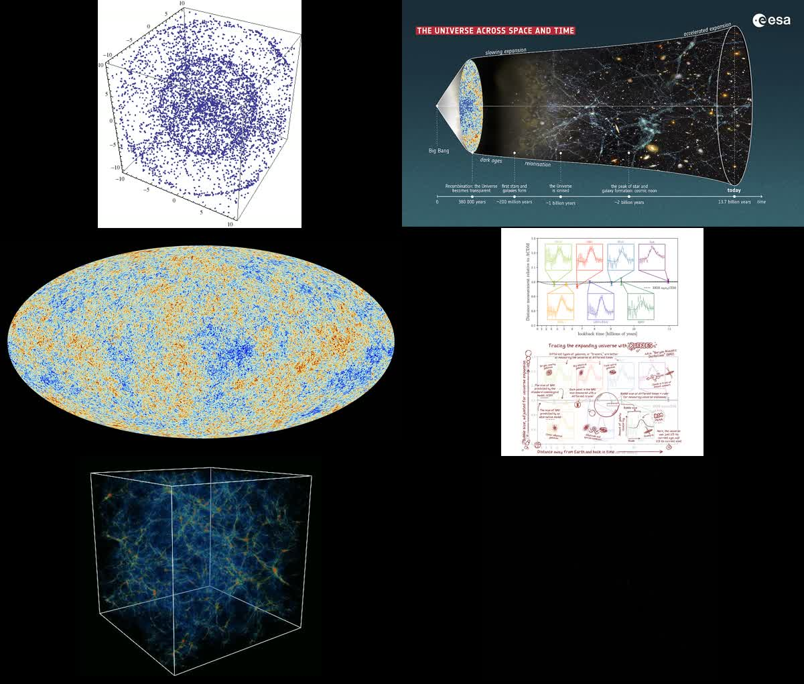

## 01 · 滚烫的等离子体与声波

**时间：** `00:00.000-00:06.400`

### 材质参考

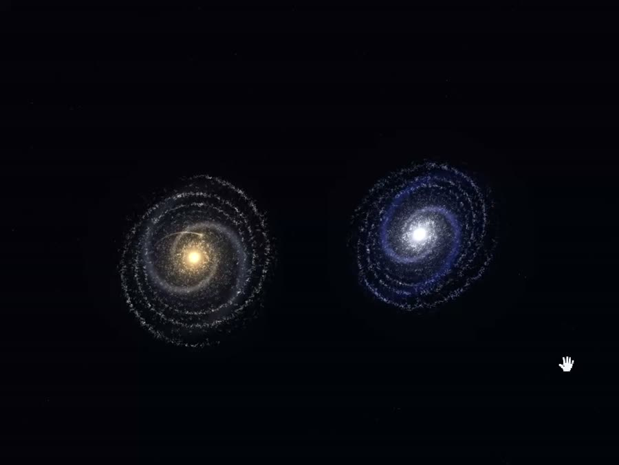

- 借鉴亮核、中密度旋臂、稀疏外缘三层粒子密度。
- 保留暖金与冷白双主体的辨识度。
- 来源：用户视频 `20260816_223430.mp4`。

### 运动结构参考

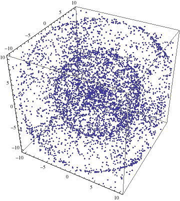

- 借鉴疏密相间的纵向声压结构。
- 改造成包裹全画面的红金色光子-重子流体。
- 不保留教学图外观。
- 来源：[Wikimedia Commons - 3D Pressure Wave](https://commons.wikimedia.org/wiki/File:3D_Pressure_(Longitudinal)_Wave.gif)。

### 画面应用

开场不再是一锅均匀发光的点云，而是一个占据画面大部分面积的“原初声学体”。主声波包从其亮核中诞生，穿过有层级的密度臂。

## 02 · 三十八万年后，一切安静

**时间：** `00:06.400-00:10.733`

### 时代与尺度参考

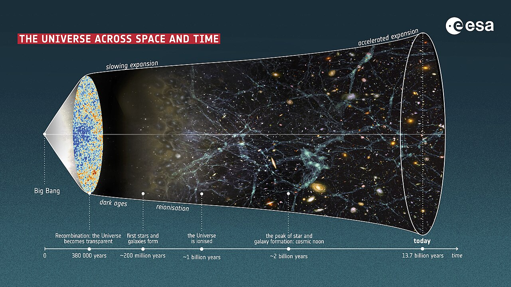

- 借鉴复合期位于宇宙历史起点的尺度感。
- 表现从早期高温到晚期结构形成的纵深。
- 来源：[ESA - The Universe Across Space and Time](https://commons.wikimedia.org/wiki/File:The_Universe_across_space_and_time_ESA505241.jpg)。

### 残留印记参考

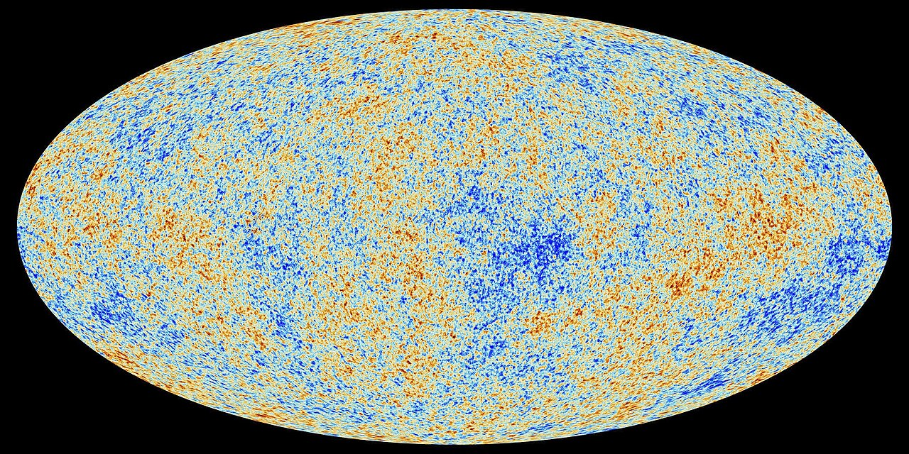

- 借鉴温度微扰的非均匀纹理。
- 只提取细微冷暖密度差，不把整张 CMB 椭圆图直接放入成片。
- 来源：[Wikimedia Commons - Cosmic Microwave Background](https://commons.wikimedia.org/wiki/File:Cosmic_Microwave_Background_(CMB).jpeg)。

### 画面应用

光子层从重子层滑开，暖色高速粒子远去；重子声壳减速悬停。背景不完全空掉，而是留下极微弱、可被下一段重新激活的温度纹理。

## 03 · 一个声波依次撞击六合

**时间：** `00:10.733-00:16.167`

### 碰撞形变参考

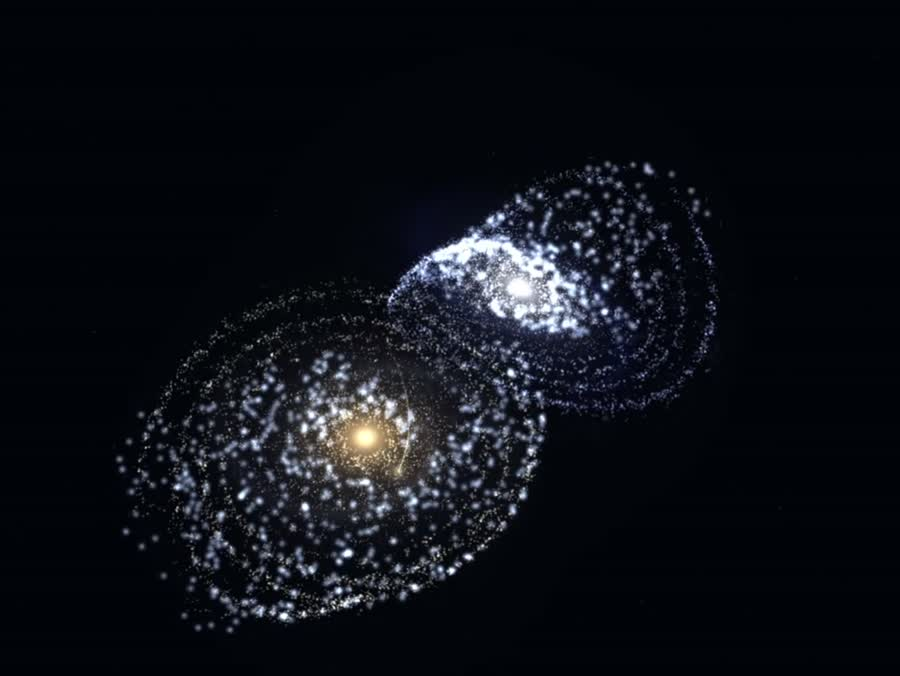

- 借鉴接触后的挤压、剪切和潮汐尾。
- 六个边界瓣必须像有质量的对象，而不是六根发光直线。
- 来源：用户视频 `20260816_223430.mp4`。

### 单一波包参考

- 始终只有一个可追踪的声压峰。
- 每次反射后继续前往下一方位，让观众能够明确数到六次撞击。
- 来源：[Wikimedia Commons - 3D Pressure Wave](https://commons.wikimedia.org/wiki/File:3D_Pressure_(Longitudinal)_Wave.gif)。

### 画面应用

每次撞击遵循“接近 -> 压扁 -> 亮核接触 -> 尾迹剥离 -> 声痕冻结”。第六次撞击击穿，六道旧伤沿原路径依次复亮并链式裂开。

## 04 · 印记写进星系之间的距离

**时间：** `00:16.167-00:24.600`

### 科学内容参考

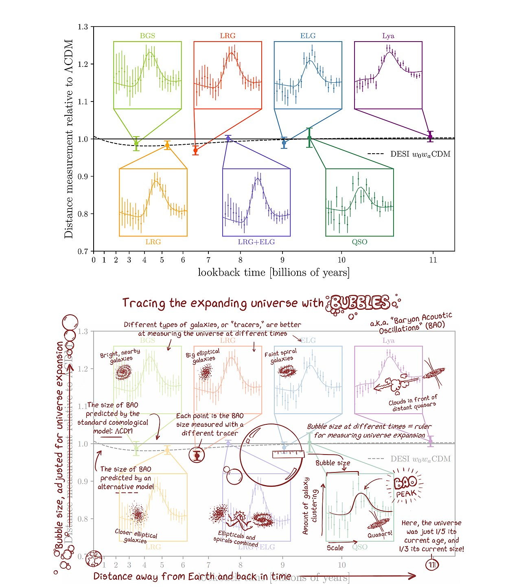

- BAO 是统计距离标尺，而不是一条装饰圆环。
- 最终画面把约 `147 Mpc` 的邻居显示在三维声壳上。
- 来源：[NOIRLab - BAO Measurement](https://commons.wikimedia.org/wiki/File:How_Baryon_Acoustic_Oscillations_Are_Used_to_Measure_the_Expanding_Universe_(noirlab2408e).jpg)。

### 信息交互参考

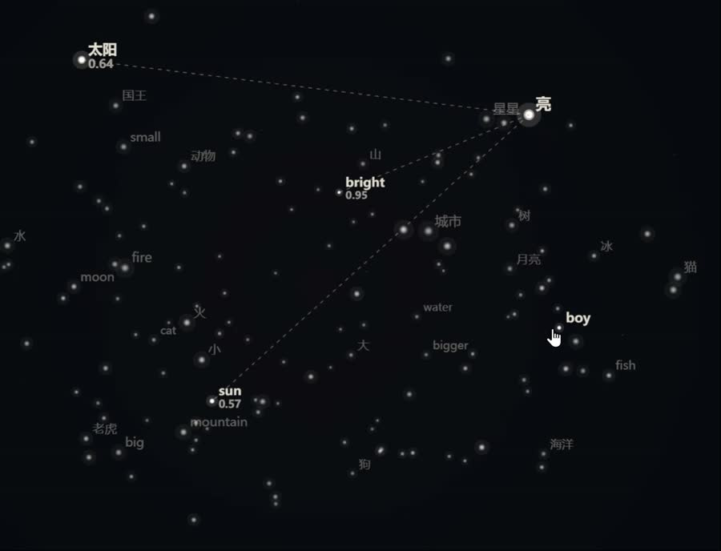

- 焦点节点升亮，背景节点降亮。
- 邻居关系线和距离数值按需展开。
- 来源：用户视频 `20260816_223530.mp4`。

### 画面应用

选中一个星系样本，声学壳上距离约 `147 Mpc` 的邻居逐一升亮；虚线与测距值贴在实体之间，让“距离里的印记”成为可读画面。

## 05 · 一百三十八亿年织成宇宙网

**时间：** `00:24.600-00:36.667`

### 结构参考

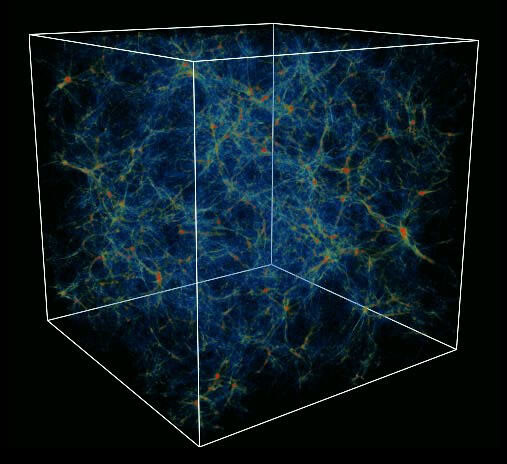

- 真正的宇宙网由片层、纤维、节点和空洞共同组成。
- 避免绘制成规则、均匀的交叉线网格。
- 来源：[Gemini Observatory - Cosmic Web Simulation](https://commons.wikimedia.org/wiki/File:The_%22cosmic_web%22_predicted_by_numerical_simulations_of_formation_of_structures_in_the_universe_(geminiann04007a).jpg)。

### 时间演化参考

- 借鉴结构从微扰到网状分布的长期演化方向。
- 使用四次局部状态变化代替直接展示整张时间线。
- 来源：[ESA - Universe Timeline](https://commons.wikimedia.org/wiki/File:The_Universe_across_space_and_time_ESA505241.jpg)。

### 画面应用

同一批粒子依次经历片层塌缩、丝状拉伸、节点聚集。`z=1100 -> 6 -> 2 -> 0` 标签直接附着在变化中的局部结构上。

## 06 · 我们是网上一点光，终会自成星河

**时间：** `00:36.667-00:42.200`

### 宇宙地址参考

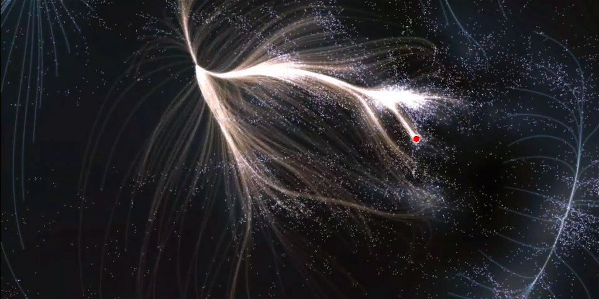

- 借鉴物质沿引力流线汇聚的方向感。
- “我们”只是巨大流域中的一个普通位置。
- 红点只作为位置逻辑参考，不直接照搬。
- 来源：[Wikimedia Commons - Laniakea](https://commons.wikimedia.org/wiki/File:Laniakea_with_Galaktika.jpg)。

### 星河成形参考

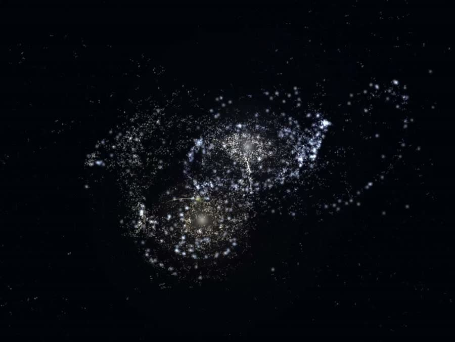

- 粒子在引力作用下形成高亮核心和长尾。
- 不突然切换成一套无关联的普通银河素材。
- 来源：用户视频 `20260816_223430.mp4`。

### 画面应用

关系线依次定位“拉尼亚凯亚 -> 本星系群 -> 银河系”；随后标注退出，镜头沿同一根引力流线滑行，原宇宙网粒子被连续拉成长河。

## 全局使用规则

参考图只定义三件事：

1. 主体密度。
2. 运动因果。
3. 信息关系。

最终配色仍使用暖金主声波与冷青宇宙结构。画面不会照搬参考图中的文字、白底图表或现成银河造型。

## 原始文件

- 网页版本：`../.superpowers/brainstorm/1880-1786888814/content/six-scene-references.html`
- 参考图总览：`../.superpowers/brainstorm/1880-1786888814/content/scene-reference-contact.jpg`
- 本地预览服务：`http://localhost:50954/`
